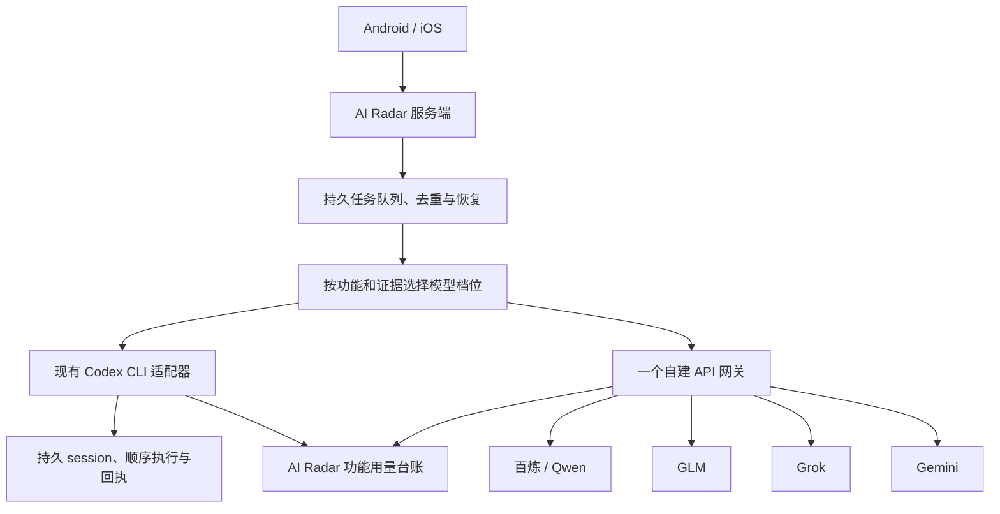

# 自建 LLM 网关与管理平台选型

调研日期：2026-09-12。范围是统一管理模型调用的开源、自托管平台，包括官方 API Key 网关，以及与现有 Codex 授权有关的订阅账号代理。核对了 12 个相关项目的官方仓库、近期发布和文档，重点比较 6 个网关平台。

## 结论

**AI Radar 首选验证 New API，备选 Bifrost；需要更复杂的多团队治理和厂商适配时再优先考虑 LiteLLM。**

- **New API** 最贴近“有中文后台、能管理多个厂商和密钥、看调用量与费用的自建中转站”。用户直接管理渠道和额度更方便。
- **Bifrost** 更适合以服务端为中心的轻量网关：开源版已有管理界面、虚拟密钥和预算，SQLite 可以减少附属服务，值得与 New API 做小规模对照验证。
- **LiteLLM** 的适配范围和治理生态更完整，但管理功能需要 PostgreSQL，并要持续跟进版本和安全更新。当前单个 AI Radar 服务不一定需要承担这些额外维护。

上述顺序是结合现有业务、部署依赖和文档能力的判断，**不是实测性能排名**。本次没有安装网关、调用付费模型或更改线上模型配置。

## 热度、维护与开源边界

Star 为 2026-09-12 的 GitHub API 快照，取近似值；它反映关注度，不代表代码质量、免费功能完整度或生产稳定性。发布信息也是当日快照，不能将表格当成永久安装版本清单。

| 项目 | Star | 开源核心许可 | 当日发布与维护状态 | 对 AI Radar 的定位 |
| --- | ---: | --- | --- | --- |
| [LiteLLM](https://github.com/BerriAI/litellm) | 58.5K | MIT；enterprise 目录另有许可 | v1.100.1，9 月 10 日；持续活跃 | 适配面广、治理完整，维护工作更多 |
| [New API](https://github.com/QuantumNous/new-api) | 47.9K | AGPL-3.0 | v1.0.0-rc.37，9 月 11 日；持续活跃 | 中文管理后台首选候选 |
| [Bifrost](https://github.com/maximhq/bifrost) | 8.0K | Apache-2.0；另有企业版 | 持续活跃；latest 指向 ent-v2.1.1-base，9 月 9 日 | 轻量私有网关候选，须核对开源发行物 |
| [Portkey Gateway](https://github.com/Portkey-AI/gateway) | 13.0K | MIT 核心 | 最新正式发布 v1.15.2，1 月 12 日；README 指向 2.0 预发布分支 | 能力值得关注，先厘清 2.0 交付状态 |
| [Higress](https://github.com/higress-group/higress) | 9.4K | Apache-2.0 | v2.2.4，8 月 13 日；持续活跃 | 适合已有云原生网关体系或需要统一 API 入口 |
| [LLM Gateway](https://github.com/theopenco/llmgateway) | 1.6K | AGPL-3.0 核心；ee 目录商用许可 | v1.16.0，9 月 7 日；持续活跃 | 后台完整，但社区规模较小、附属服务较多 |

许可依据以各仓库 LICENSE 为准，尤其不能仅依赖 GitHub 自动识别：LiteLLM 和 LLM Gateway 的 API 许可字段显示 NOASSERTION，进一步阅读原文件才可确认核心与企业代码的区分。[LiteLLM LICENSE](https://github.com/BerriAI/litellm/blob/litellm_internal_staging/LICENSE)、[LLM Gateway LICENSE](https://github.com/theopenco/llmgateway/blob/main/LICENSE)。

## 三个重点候选

### New API：最接近用户可以自己管理的“中转站”

它以渠道、令牌、模型映射、分组、额度和用量后台为中心，中文界面成熟，也内置充值等面向多用户服务的功能。对当前需求，最有用的是在后台集中维护百炼、GLM、Grok、Gemini 等上游，给不同业务签发独立令牌，并查看模型、渠道和令牌维度的消耗。AI Radar 自用不需要启用公开注册或支付模块。[项目说明](https://github.com/QuantumNous/new-api)、[渠道管理](https://docs.newapi.pro/zh/docs/guide/console/channel-management)、[统计面板](https://docs.newapi.pro/zh/docs/guide/feature-guide/user/dashboard)。

它支持多种模型协议及格式转换，但“能转发一次文本对话”并不等于业务兼容：需要另外核对 Responses、严格结构化输出、推理参数、缓存与推理 Token 字段，以及错误信息是否正确保留。价格与倍率配置也要跟随真实合同价格维护，不能默认后台估算就是厂商账单。

部署上，程序可使用 SQLite，但官方推荐的 Docker Compose 包含 PostgreSQL 与 Redis；本地开发文档把 SQLite 定位为开发、测试场景。因此，不应为了节约内存就未经验证将 SQLite 作为长期生产方案。[Compose 部署](https://docs.newapi.pro/zh/docs/installation/deployment-methods/docker-compose-installation)、[本地开发与数据库](https://docs.newapi.pro/en/docs/installation/deployment-methods/local-development)。

当前最新发布的名称仍是 `v1.0.0-rc.37`，即使 GitHub 没有将它标为 prerelease，也应按候选版本名称审视发布质量。同时，近期安全修复发生在 rc 系列，不能简单退回很老的正式版本来换取“稳定”标签。[发布记录](https://github.com/QuantumNous/new-api/releases/tag/v1.0.0-rc.37)。

**适合选择它的条件：**希望有中文后台，常在界面里调整厂商、模型和额度；接受维护数据库和及时跟进安全更新。它是本项目最贴近使用习惯的第一候选。

### Bifrost：轻量部署与服务端集成的有力备选

Bifrost 使用 Go，开源版已经提供 Web 管理界面、虚拟密钥、预算与速率限制、路由、重试与备用上游，以及日志和指标能力。免费版并非只有一个转发接口，不需要为了基本用量限制先购买企业版。[仓库](https://github.com/maximhq/bifrost)、[虚拟密钥](https://docs.getbifrost.ai/features/governance/virtual-keys)、[预算与限流](https://docs.getbifrost.ai/features/governance/budget-and-limits)。

开源版默认用 SQLite 保存配置和日志，也可使用 PostgreSQL。这意味着单实例可以少维护附属服务；企业版迁移要求 PostgreSQL。这里的“轻量”是部署构成上的判断，本次没有测量它在真实翻译负载下的内存或延迟，也不采用官网的倍数性能宣传作为选型证据。[存储](https://docs.getbifrost.ai/architecture/framework/config-store)、[开源版与企业版迁移](https://docs.getbifrost.ai/enterprise/moving-from-oss/overview)。

Gemini、xAI 有原生 provider；百炼、GLM 可评估通过自定义 OpenAI 兼容 provider 接入。兼容 provider 不保证厂商特有参数全部适配，需要测试真实业务 Schema 和费用字段。[自定义 provider](https://docs.getbifrost.ai/providers/custom-providers)、[Gemini](https://docs.getbifrost.ai/providers/supported-providers/gemini)、[xAI](https://docs.getbifrost.ai/providers/supported-providers/xai)。

企业版功能边界需要看清：SSO、RBAC、Projects、审计日志、集群、自适应负载均衡和部分高级治理列在企业能力中。当前按功能统计可以使用不同虚拟密钥，不必依赖付费 Projects。[企业能力清单](https://docs.getbifrost.ai/enterprise/overview)。

另外，GitHub 的 latest 当前指向带 `ent-` 的企业版基础标签，仓库还有大量 Go 模块标签。**不能把 latest 或单个 transports/core 模块版本直接当成开源网关的完整部署版本。** 后续部署必须确认开源发行物、镜像与所含模块版本的对应关系。[发布列表](https://github.com/maximhq/bifrost/releases)。

**适合选择它的条件：**管理操作主要由程序完成，界面不一定要中文，希望尽量减少额外数据库服务。若 New API 实测资源占用偏高，优先比较它。

### LiteLLM：广覆盖与完整治理生态

LiteLLM 提供统一接口、广泛的厂商适配、虚拟密钥、用户与团队管理、预算、费用统计和路由故障切换。它还有 Python SDK，但自建中转站应评估的是独立 Proxy 服务；不能把“装一个 SDK”与“拥有管理平台”混为一谈。[仓库与架构](https://github.com/BerriAI/litellm)。

开源版可以满足基本的虚拟密钥、预算、费用和指标需求；Projects、按标签预算、部分按模型细分预算、软预算邮件提醒和高级治理在企业功能清单里。对于 AI Radar，先按业务功能分配虚拟密钥，通常比围绕付费标签预算设计系统更直接。[开源与企业功能对照](https://docs.litellm.ai/docs/enterprise)。

虚拟密钥管理需要 PostgreSQL；多实例共享路由状态、额度和限流通常还需要 Redis。单实例不能笼统说“必须同时上 Redis”，但也不能按只有一个代理进程估算完整管理平台的部署成本。[虚拟密钥要求](https://docs.litellm.ai/docs/proxy/virtual_keys)、[生产部署](https://docs.litellm.ai/docs/proxy/prod)。

它适合将来接入更多厂商、多个应用或团队，并希望复用现成治理与观测集成的情况。当前不将它排在第一位，是因为现有业务已经有用量台账和任务管理，且近期供应链与网关安全事件使版本维护成为需要正面考虑的成本，详见下文。

## 另外三个网关为何暂不优先

**Portkey Gateway：值得跟踪 2.0，但不能混用不同版本的宣传与交付能力。** 官方 2.0 文章称预算、熔断、模型目录、元数据治理等已向开源开放；然而仓库 README 仍提示 2.0 预发布分支，最新正式 Release 仍为 1.15.2。不能沿用旧说法认定所有预算能力都付费，也不能假定当前稳定镜像已有全部 2.0 功能。基础开源网关有本地控制台；云端管理平台、混合部署控制面和完全自托管管理的边界应按具体版本核对。[2.0 公告](https://portkey.ai/blog/gateway-2-0/)、[2.0 分支](https://github.com/Portkey-AI/gateway/tree/2.0.0)、[混合部署架构](https://portkey.ai/docs/self-hosting/hybrid-deployments/architecture)。

**Higress：国内厂商支持很有吸引力，但定位更偏基础设施。** AI Proxy 插件覆盖 Qwen/DashScope、智谱、DeepSeek、Grok、Gemini 等，适合把 AI 流量治理纳入统一 API 网关。它支持独立 Docker 部署，并非只能用 Kubernetes；但 Envoy、插件和网关管理的维护方式，相比专门的模型管理后台更偏工程运维。AI Radar 已有正常工作的入口与其他服务，当前没有统一改造入口的必要。[项目架构](https://higress.ai/en/docs/latest/overview/what-is-higress/)、[AI Proxy 厂商适配](https://higress.ai/en/docs/latest/user/plugins/ai/api-provider/ai-proxy/)。

**LLM Gateway：界面和自托管形态完整，但目前生态较小。** 有后台、BYOK、用量分析等能力；自托管包含 UI、API、网关、后台任务、PostgreSQL 和 Redis，即使打包在统一容器也不意味着没有这些依赖。核心 AGPL，部分企业功能另有商用许可。适合列入观察名单，当前没有足够优势让本项目优先承担较小生态和多组件的维护成本。[自托管](https://docs.llmgateway.io/self-host)、[Compose](https://docs.llmgateway.io/self-host/docker-compose)、[许可](https://github.com/theopenco/llmgateway/blob/main/LICENSE)。

## 订阅账号转 API：另一个方向的两款热门项目

| 项目 | Star / 核心许可 | 实际解决的问题 | 对现有 Codex 的意义 |
| --- | --- | --- | --- |
| [CLIProxyAPI](https://github.com/router-for-me/CLIProxyAPI) | 51.5K / MIT | 将包括 Codex、Claude 等在内的账号授权接入统一 API 代理 | 可作为独立架构方案研究；本次不迁移现有授权 |
| [Sub2API](https://github.com/Wei-Shaw/sub2api) | 41.3K / LGPL-3.0 | 订阅额度分发、多账号调度、密钥、计费与管理后台 | 偏订阅账号管理平台，并不天然接管应用的持久任务和会话恢复 |

这两款都在持续发布，不能遗漏，因为用户现有 Codex 能力来自账号授权。它们与“持有厂商官方 API Key、按公开 API 调用”的网关路线不同。Sub2API 的项目说明也明确提示使用者需要关注上游服务条款；本次没有评估账号兼容性、实际授权流程或用于后台任务的适用边界。[CLIProxyAPI 说明](https://github.com/router-for-me/CLIProxyAPI)、[Sub2API 说明](https://github.com/Wei-Shaw/sub2api/blob/main/README.md)。

现有 AI Radar 不仅需要模型回复，还依赖 Codex CLI 的 session ID、恢复记录、顺序执行、回执和中断处理。代理宣称支持“会话粘性”或 OAuth，不等于这些业务语义原样保留。因此当前建议保留官方 Codex CLI 适配器，将订阅代理作为独立候选评估，避免在引入 API 管理后台时同时重写会话机制。

## 不应混为同类，或不适合作为新部署首选

- **[One API](https://github.com/songquanpeng/one-api)**：约 36.9K Star，MIT，是这一方向的重要项目；当日最新 Release 为 2025-02-02 的 v0.6.10，最近 push 为 2026-01-09。仓库未归档，但近期发布节奏明显慢于 New API，不作为本次新部署的第一候选。
- **[TensorZero](https://github.com/tensorzero/tensorzero)**：约 11.7K Star，仓库已在 **2026-06-12 归档**。旧推荐文章中的热度不应覆盖当前维护状态，本次排除。
- **[Kong](https://github.com/Kong/kong)**：约 44.1K Star 是整个 API 网关项目的关注度。核心开源不意味着所有 AI 能力开源；[AI Proxy Advanced](https://developer.konghq.com/plugins/ai-proxy-advanced/) 标注 Enterprise。已有 Kong 平台时值得考虑，当前个人服务没有必要仅为中转模型引入它。
- **[Langfuse](https://github.com/langfuse/langfuse)**：约 34.5K Star，主要解决追踪、评估、提示词与观测问题，可以配合网关；它不是统一转发、密钥与故障路由网关的直接替代。AI Radar 已有用量台账和 OTel/Prometheus，不必为了接入模型网关立即叠加完整观测平台。

## 已发现的真实安全与发布风险

本节列出会影响选型和安装版本的公开事实，不把“开源”或 Star 数当成免审查保证，也不据此声称某个当前版本绝对安全。

| 项目 | 已核实事件 | 对选型的具体影响 |
| --- | --- | --- |
| LiteLLM | PyPI **1.82.7、1.82.8** 曾被植入窃取凭据的恶意代码；另有网关鉴权和上游凭据泄露相关公告 | 对集中保存多家密钥的平台，这是实质性的维护风险。需使用确认来源与修复状态的发行物，固定版本和摘要，隔离网关凭据与宿主其他授权；不能随手运行任意历史安装命令 |
| New API | 历史版本有根访问令牌泄露和配额整数溢出问题；公告分别给出 rc.7、rc.18 等修复边界 | 老正式版未必优于新 rc。部署前逐项核对所选版本包含修复，自用不开放不需要的公开注册、充值与管理员入口 |
| Bifrost | core 模块曾有 URL 获取逻辑的 SSRF 地址过滤缺陷，公告标示 core ≤1.5.15 受影响，≥1.5.16 修复 | 必须核对镜像里实际包含的 core 模块，不能只看外层网关或企业基础版本号 |

来源：[LiteLLM 恶意包公告](https://github.com/advisories/GHSA-92x9-889m-jgmw)、[LiteLLM 上游凭据公告](https://github.com/BerriAI/litellm/security/advisories/GHSA-3cv6-jpf6-8222)、[New API 令牌泄露公告](https://github.com/QuantumNous/new-api/security/advisories/GHSA-6x2c-phff-wx57)、[New API 配额公告](https://github.com/QuantumNous/new-api/security/advisories/GHSA-8r8v-xf7q-rcpr)、[Bifrost SSRF 公告](https://github.com/maximhq/bifrost/security/advisories/GHSA-w98g-5w9p-p3rc)。

网关鉴权也需要显式核对。例如 Bifrost 文档提供 `enforce_auth_on_inference` 来强制推理请求使用虚拟密钥；不能只设置管理界面密码就默认推理接口受保护。内容日志应按需要关闭或脱敏，并限制留存，避免额外复制完整文章、提示词或授权信息。[Bifrost 治理配置](https://docs.getbifrost.ai/deployment-guides/config-json/governance)、[内容日志](https://docs.getbifrost.ai/features/observability/content-logging)。

## 放进 AI Radar 后，哪些职责留在哪里

**网关负责**上游地址和密钥、统一入口、模型别名、访问额度、限流、调用指标，以及经过配置的可重试错误处理。后端仍可使用已有 OpenAI SDK 适配器，但必须补齐真实厂商和模型归属；只修改 `base_url` 不会自动得到全部治理能力。

**AI Radar 负责**文章采集、翻译准确性审核、来源与公式校验、持久队列、失败恢复、模型职责和升级规则。“Astra low 无法决断才升级 Astra medium”是基于内容证据的业务决策，网关的 429/超时故障切换不能替代它。目前三档路由只接管 Codex，跨厂商的角色配置仍需扩展，见 [GLM、Grok、Gemini 接入核对](MODEL-PROVIDERS.md)。

对用户最关心的成本与可靠性，建议保留以下设计：

1. **按功能分配虚拟密钥。** 翻译、网页分析、日报、发现与前瞻分别标记，附加 `job_id`、stage、role。网关看费用与额度，AI Radar 关联具体任务；按真实最终 provider/model/effort 记账，不只记录别名。前端继续按 K → M → B 展示 Token。
2. **网关统计不能替代厂商余额。** 网关“钱包”通常是内部额度或估算费用；百炼账户余额、DeepSeek 余额、Codex 订阅额度仍由现有各自查询逻辑负责。订阅 Token 不能套 API 单价伪装为实际支出。
3. **重试设总预算。** SDK、网关、后台任务不能各自无限重试或逐层放大次数。超时后上游可能已计费；应记录不确定状态、区分可重试错误，并以业务任务和调用尝试两级记录核对。不能承诺所有外部调用严格只执行一次。
4. **不默认打开语义响应缓存。** 相似文章可能在数字、否定、版本号或公式上不同。翻译与摘要继续按内容指纹、处理版本和审核状态复用结果；供应商的输入前缀缓存是另一种能力，应单独记录命中费用。
5. **备用路由也受预算与能力约束。** 廉价 API 的临时错误不应让全部批任务自动转到高价模型；备用型号必须满足相同业务输出能力，切换原因和额外花费可追踪。

## 服务器适配与后续验证范围

本次只读检查的现有服务器为 **2 核、约 4GB 内存**，系统当时报告可用内存约 **2GB**、磁盘余量约 **32GB**。这是瞬时余量，现有浏览器采集和模型任务会波动，不能直接视为可全部分配给网关的容量。

因此建议一次只验证一个候选：先 New API，再按资源和使用体验决定是否比较 Bifrost。使用独立私有端口、独立持久目录和受限账户；不占用现有 8080 或 AI Radar 已用端口，不替换现有 Caddy 入口。这里没有执行任何安装或服务重启。

| 验证项 | 通过标准 |
| --- | --- |
| 真实协议能力 | 百炼及选定新厂商能完成业务 Schema；数字、否定、中文、来源 ID、长文与公式的处理通过现有审核；确认各家的推理参数实际生效 |
| 用量可核对 | 输入、输出、缓存、推理 Token 按厂商实际提供的字段记录；缺失值标为未知；按任务和功能汇总能与调用回执核对，不重复累加 |
| 错误与恢复 | 模拟授权失效、余额不足、429、连接中断和未知结果，验证手机提示、重试预算、备用路由和任务最终状态 |
| 资源与隔离 | 在真实采集、翻译并发时观测 CPU、内存、延迟和磁盘增长；确认不会挤占已有浏览器和 API；验证管理与推理接口鉴权 |
| 运维可持续 | 固定经过核对的发行物；数据库/配置可备份恢复；升级和回滚有明确路径；管理日志不暴露上游密钥 |

**最终建议：**先以 New API 作为中文管理体验的验证对象；若希望依赖更少或实测资源不足，转向 Bifrost 对照。暂不同时部署多个网关，也不迁移 Codex 会话体系。等真实业务兼容、统计和恢复验证通过后，再决定是否将现有 API 调用统一接入。

## 调研方法与限制

使用官方 GitHub API 查询关注度、归档状态、最近提交与发布，阅读项目 LICENSE、官方自托管与功能分层文档，并抽查相关公开安全公告。服务器检查仅获取资源与负载信息。

没有进行网关安装、源码全量审计、容器供应链审计、压力测试、实际模型收费调用或商业版试用。因此本文给出的是有依据的候选顺序与验证方案，不声称已经确认全部兼容性、资源上限、许可适用情况或所有漏洞均已修复。具体可用型号、服务地区和费用仍按用户实际账户核实。
